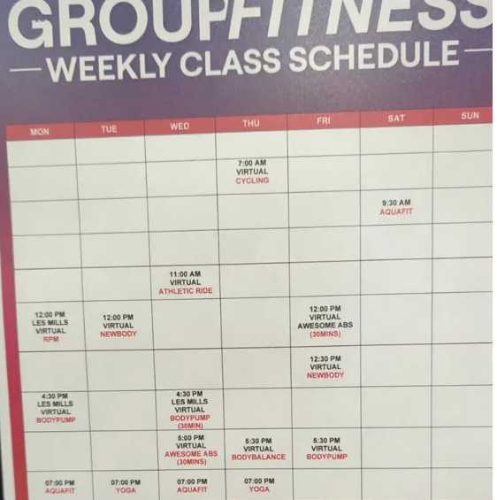

# AI-Powered UI Testing with Tools4AI and Selenium

## Introduction

Automated UI testing has long been a staple in ensuring that web applications meet design and functionality standards. Traditional methods, such as using Selenium, involve interacting with the UI through specific code tied to the structure of the webpage. However, a new AI-driven method using Tools4AI is changing the game by allowing us to translate visual elements directly into code objects, simplifying the testing process considerably.

> **Note**: For background on image-based function calls, see the [previous article on Image Processing](4_ImageProcessing.md).

## Comparing Traditional and AI-Driven Approaches

### The Traditional Selenium Way

Let's start with a simple example of testing a website for an auto repair shop. With traditional Selenium, you might write code like this to check service prices:

```java
WebElement oilChangePrice = driver.findElement(By.id("oilChangePrice"));
assert "29.99".equals(oilChangePrice.getText());
```

Conventionally, to verify that the "Full Inspection" service on the AutoServicingPro website is listed as "Starting at $99.99," you would:
1. Use Selenium to locate the web element
2. Extract the text from the element
3. Assert the value against your expected text

While this method works, it has drawbacks - any change to the website's layout could break your test, requiring code updates.

### The AI-Based Method


First, capture the screenshot using Selenium:

```java
WebDriverManager.chromedriver().setup();

ChromeOptions options = new ChromeOptions();
options.addArguments("--headless");  // Setting headless mode
options.addArguments("--disable-gpu");  // GPU hardware acceleration isn't useful in headless mode
options.addArguments("--window-size=1920,1080");  // Set the window size
WebDriver driver = new ChromeDriver(options);

driver.get("https://google.com");
// Take screenshot and save it as file or use as bytes
TakesScreenshot ts = (TakesScreenshot) driver;
byte[] screenshotBytes = ts.getScreenshotAs(OutputType.BYTES);
GeminiImageActionProcessor imageActionProcessor = new GeminiImageActionProcessor();
imageActionProcessor.imageToText(screenshotBytes);
// Alternatively, save to file:
// File srcFile = ts.getScreenshotAs(OutputType.FILE);
// File destFile = new File("screenshot.png");
// FileHandler.copy(srcFile, destFile);
driver.quit();
```

Then process the image with Tools4AI:

```java
String jsonStr = processor.imageToJson(
    GeminiImageExample.class.getClassLoader().getResource("auto.png"),
    "Full Inspection"
);
```

The returned JSON will look like this:

```json
{
  "fieldName": "Full Inspection",
  "fieldType": "String",
  "fieldValue": "Starting at $99.99"
}
```

This JSON can be easily validated against a "golden copy" when UI changes occur.

#### Option 2: POJO-Based Approach

Define your POJO structure:

```java
@Getter
@Setter
@ToString
@NoArgsConstructor
@AllArgsConstructor
public class AutoRepairScreen {
    double fullInspectionValue;
    double tireRotationValue;
    double oilChangeValue;
    Integer phoneNumber;
    String email;
    String[] customerReviews;
}
```

Then use it directly with Tools4AI:

```java
AutoRepairScreen screenData = aiProcessor.imageToPojo("screenshot.png", AutoRepairScreen.class);
assert screenData.oilChangePrice == 29.99;
```

## Real-World Example: Gym Schedule Testing



Let's explore a more complex example with a gym schedule. This example demonstrates how visual information can be transformed into structured Java objects.

### The POJO Structure

```java
@Getter
@Setter
@NoArgsConstructor
@ToString
public class MyGymSchedule {
    @ListType(Activity.class)
    List<Activity> myWeeklyActivity;
}

@Getter
@Setter
@NoArgsConstructor
@ToString
public class Activity {
    String dayOfTheWeek;
    String activityName;
}
```

### Processing the Schedule

```java
GeminiImageActionProcessor processor = new GeminiImageActionProcessor();
Object pojo = processor.imageToPojo(
    GeminiImageExample.class.getClassLoader().getResource("fitness.png"),
    MyGymSchedule.class
);
log.info(pojo.toString());
```

The processed output will contain the full weekly schedule:

```
MyGymSchedule(myWeeklyActivity=[
    Activity(dayOfTheWeek=Monday, activityName=LES MILLS VIRTUAL RPM),
    Activity(dayOfTheWeek=Monday, activityName=VIRTUAL NEWBODY),
    Activity(dayOfTheWeek=Tuesday, activityName=VIRTUAL NEWBODY),
    Activity(dayOfTheWeek=Wednesday, activityName=VIRTUAL ATHLETIC RIDE),
    Activity(dayOfTheWeek=Thursday, activityName=VIRTUAL CYCLING),
    Activity(dayOfTheWeek=Friday, activityName=VIRTUAL AWESOME ABS),
    Activity(dayOfTheWeek=Friday, activityName=VIRTUAL NEWBODY),
    Activity(dayOfTheWeek=Saturday, activityName=AQUAFIT),
    Activity(dayOfTheWeek=Sunday, activityName=AQUAFIT)
])
```

## Complete Example

Here's a complete example showing various ways to use the Tools4AI image processing capabilities:

```java
public static void main(String[] args) throws AIProcessingException {
    GeminiImageActionProcessor processor = new GeminiImageActionProcessor();
    
    // Single field extraction
    String jsonStr = processor.imageToJson(
        GeminiImageExample.class.getClassLoader().getResource("images/auto.png"),
        "Full Inspection"
    );
    log.info(jsonStr);
    
    // Multiple field extraction
    jsonStr = processor.imageToJson(
        GeminiImageExample.class.getClassLoader().getResource("images/auto.png"),
        "Full Inspection", "Tire Rotation", "Oil Change"
    );
    log.info(jsonStr);
    
    // Full POJO conversion for auto repair screen
    jsonStr = processor.imageToJson(
        GeminiImageExample.class.getClassLoader().getResource("images/auto.png"),
        AutoRepairScreen.class
    );
    log.info(jsonStr);
    
    // Full POJO conversion for fitness schedule
    jsonStr = processor.imageToJson(
        GeminiImageExample.class.getClassLoader().getResource("images/fitness.png"),
        MyGymSchedule.class
    );
    log.info(jsonStr);
    
    // Direct POJO creation from images
    Object pojo = processor.imageToPojo(
        GeminiImageExample.class.getClassLoader().getResource("images/fitness.png"),
        MyGymSchedule.class
    );
    log.info(pojo.toString());
    
    pojo = processor.imageToPojo(
        GeminiImageExample.class.getClassLoader().getResource("images/auto.png"),
        AutoRepairScreen.class
    );
    log.info(pojo.toString());
}
```

## Conclusion

Tools4AI exemplifies how AI can simplify complex processes, offering a glimpse into a future where AI and machine learning continually reduce the manual workload in software development and quality assurance. Whether you're dealing with a photo or a screenshot from a website, the method remains the same, providing quick and accurate digitization of information that was once locked in static images.
